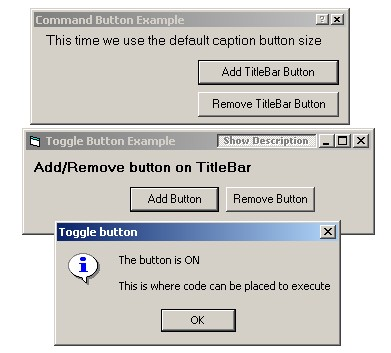

<div align="center">

## TitleBar Button Example


</div>

### Description

Place a command or toggle button on TitleBar of a form
 
### More Info
 
Advanced

A beginner can use this code, an expert can understand it. By including a class and a module, the code is easily reused with only a few lines of code

No side effects


<span>             |<span>
---                |---
**Submitted On**   |2001-03-31 03:05:28
**By**             |[Robert E\. Phelps](https://github.com/Planet-Source-Code/PSCIndex/blob/master/ByAuthor/robert-e-phelps.md)
**Level**          |Advanced
**User Rating**    |4.9 (64 globes from 13 users)
**Compatibility**  |VB 6\.0
**Category**       |[Windows API Call/ Explanation](https://github.com/Planet-Source-Code/PSCIndex/blob/master/ByCategory/windows-api-call-explanation__1-39.md)
**World**          |[Visual Basic](https://github.com/Planet-Source-Code/PSCIndex/blob/master/ByWorld/visual-basic.md)
**Archive File**   |[CODE\_UPLOAD177413312001\.zip](https://github.com/Planet-Source-Code/robert-e-phelps-titlebar-button-example__1-22039/archive/master.zip)

### API Declarations

```
CopyMemory, CallWindowProc, CreateFontIndirect, CreateWindowEx
DestroyWindow, GetFocus, GetProp, GetSystemMetrics, GetWindowLong
GetWindowRect, PostMessage, RemoveProp, SendMessage, SetFocus
SetParent, SetProp, SetWindowLong, SetWindowPos, ShowWindow
SystemParametersInfo
RECT
WM_SIZE, WM_LBUTTONUP, WM_WINDOWPOSCHANGED, WM_SETFONT
BM_SETCHECK, BM_CLICK
GWL_STYLE, GWL_EXSTYLE
WS_CAPTION, WS_CHILD, WS_EX_TOOLWINDOW
WS_THICKFRAME, WS_MAXIMIZEBOX, WS_MINIMIZEBOX
BS_PUSHBUTTON, BS_AUTOCHECKBOX, BS_PUSHLIKE
GWL_WNDPROC
SWP_FRAMECHANGED, SWP_NOACTIVATE
SW_SHOWNOACTIVATE
SM_CXFIXEDFRAME, SM_CXSIZEFRAME, SM_CXSIZE
SM_CXSMSIZE, SM_CYCAPTION, SM_CYSMCAPTION
WINDOWPOS
LF_FACESIZE, LOGFONT
SPI_GETNONCLIENTMETRICS, NONCLIENTMETRICS
```


